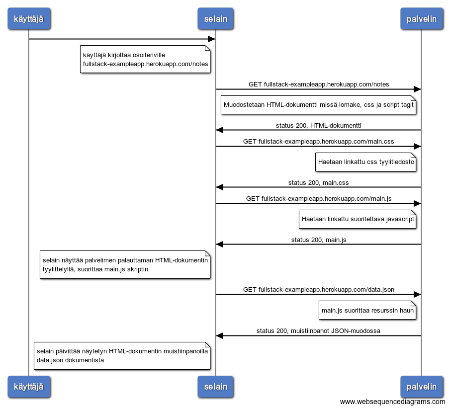
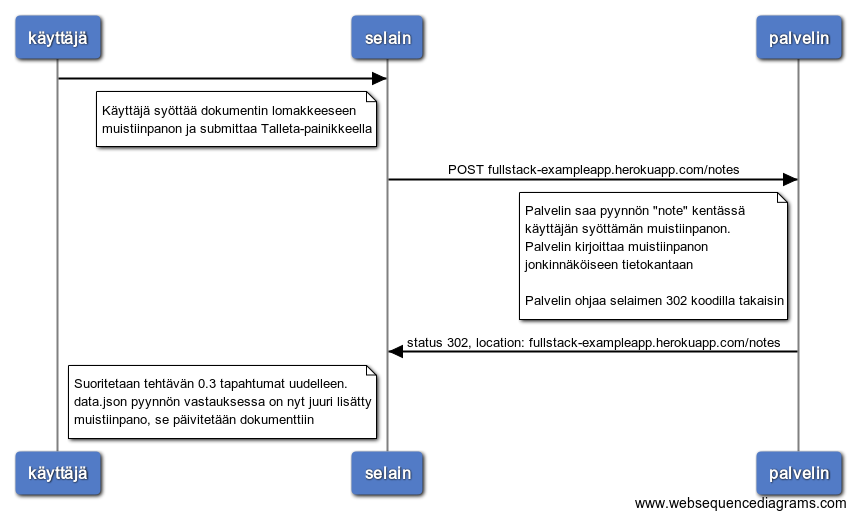
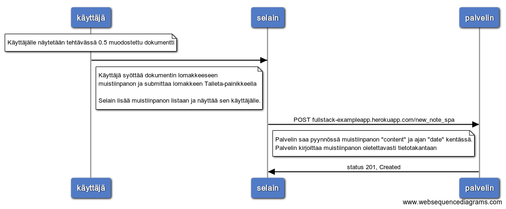

# 0.3 Muistiinpanojen sivu

```
käyttäjä->selain:
note left of selain
käyttäjä kirjottaa osoiteriville
fullstack-exampleapp.herokuapp.com/notes
end note
selain->palvelin: GET fullstack-exampleapp.herokuapp.com/notes
note left of palvelin
  Muodostetaan HTML-dokumentti missä lomake, css ja script tagit
end note
palvelin->selain: status 200, HTML-dokumentti

selain->palvelin: GET fullstack-exampleapp.herokuapp.com/main.css
note left of palvelin
  Haetaan linkattu css tyylitiedosto
end note
palvelin->selain: status 200, main.css

selain->palvelin: GET fullstack-exampleapp.herokuapp.com/main.js
note left of palvelin
  Haetaan linkattu suoritettava javascript
end note
palvelin->selain: status 200, main.js

note left of selain
 selain näyttää palvelimen palauttaman HTML-dokumentin
 tyylittelyllä, suorittaa main.js skriptin
end note
selain->palvelin: GET fullstack-exampleapp.herokuapp.com/data.json
note left of palvelin
 main.js suorittaa resurssin haun
end note
palvelin->selain: status 200, muistiinpanot JSON-muodossa

note left of selain
 selain päivittää näytetyn HTML-dokumentin muistiinpanoilla
 data.json dokumentista
end note
```


# 0.4 Uusi muistiinpano

```
note over käyttäjä
  Käyttäjälle näytetään tehtävässä 0.3 muodostettu dokumentti
end note

käyttäjä->selain:
note left of selain
  Käyttäjä syöttää dokumentin lomakkeeseen
  muistiinpanon ja submittaa Talleta-painikkeella
end note
selain->palvelin: POST fullstack-exampleapp.herokuapp.com/notes
note left of palvelin
  Palvelin saa pyynnön "note" kentässä
  käyttäjän syöttämän muistiinpanon.
  Palvelin kirjoittaa muistiinpanon
  jonkinnäköiseen tietokantaan
  
  Palvelin ohjaa selaimen 302 koodilla takaisin 
end note
palvelin->selain: status 302, location: fullstack-exampleapp.herokuapp.com/notes

note left of selain
  Suoritetaan tehtävän 0.3 tapahtumat uudelleen.
  data.json pyynnön vastauksessa on nyt juuri lisätty
  muistiinpano, se päivitetään dokumenttiin
end note
```


# 0.5 Single page app

Sekvenssikaavio on muuten sama kuin tehtävässä 0.3, erot ovat navigoitava polku /notes -> /spa ja ladattu spa.js tiedosto.

```
käyttäjä->selain:
note left of selain
käyttäjä kirjottaa osoiteriville
fullstack-exampleapp.herokuapp.com/spa
end note
selain->palvelin: GET fullstack-exampleapp.herokuapp.com/spa
note left of palvelin
  Muodostetaan HTML-dokumentti missä lomake, css ja script tagit
end note
palvelin->selain: status 200, HTML-dokumentti

selain->palvelin: GET fullstack-exampleapp.herokuapp.com/main.css
note left of palvelin
  Haetaan linkattu css tyylitiedosto
end note
palvelin->selain: status 200, main.css

selain->palvelin: GET fullstack-exampleapp.herokuapp.com/spa.js
note left of palvelin
  Haetaan linkattu suoritettava javascript
end note
palvelin->selain: status 200, spa.js

note left of selain
 selain näyttää palvelimen palauttaman HTML-dokumentin
 tyylittelyllä, suorittaa spa.js skriptin
end note
selain->palvelin: GET fullstack-exampleapp.herokuapp.com/data.json
note left of palvelin
 spa.js suorittaa resurssin haun
end note
palvelin->selain: status 200, muistiinpanot JSON-muodossa

note left of selain
 selain päivittää näytetyn HTML-dokumentin muistiinpanoilla
 data.json dokumentista
end note
```


# 0.6 Uusi muistiinpano SPA:ssa

```
note over käyttäjä
  Käyttäjälle näytetään tehtävässä 0.5 muodostettu dokumentti
end note

käyttäjä->selain:
note left of selain
  Käyttäjä syöttää dokumentin lomakkeeseen
  muistiinpanon ja submittaa lomakkeen Talleta-painikkeella

  Selain lisää muistiinpanon listaan ja näyttää sen käyttäjälle.
end note

selain->palvelin: POST fullstack-exampleapp.herokuapp.com/new_note_spa
note left of palvelin
  Palvelin saa pyynnössä muistiinpanon "content" ja ajan "date" kentässä.
  Palvelin kirjoittaa muistiinpanon oletettavasti tietotakantaan
end note
palvelin->selain: status 201, Created
```


